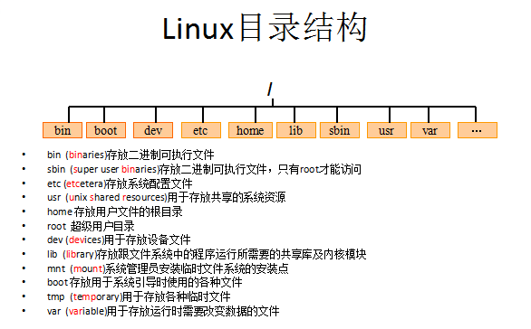

# Linux 学习笔记

[TOC]

## 1. Linux概述

### 1.1 概述

- Linux是一种自由和开放源码的操作系统，存在着许多不同的Linux版本，但它们都使用了Linux内核。
- Linux可安装在各种计算机硬件设备中，比如手机、平板电脑、路由器、台式计算机。
- Linux诞生于1991 年10 月5 日，是由芬兰赫尔辛基大学学生Linus Torvalds和后来加入的众多爱好者共同开发完成。
- Linux基于Unix。
  - Unix是一个强大的多用户、多任务操作系统。
  - 于1969年在AT&T的贝尔实验室开发。
  - UNIX的商标权由国际开放标准组织（The Open Group）所拥有。
  - UNIX操作系统是商业版，需要收费，价格比Microsoft Windows正版要贵一些。

### 1.2 历史

Linux最初是由芬兰赫尔辛基大学学生Linus Torvalds由于自己不满意教学中使用的MINIX操作系统， 所以在1990年底由于个人爱好设计出了LINUX系统核心。

后来发布于芬兰最大的ftp服务器上，用户可以免费下载，所以它的周边的程序越来越多，Linux本身也逐渐发展壮大起来，之后Linux在不到三年的时间里成为了一个功能完善，稳定可靠的操作系统。


## 2. Linux文件系统目录结构




## 3. Linux常用命令

### 3.1 grep


### 3.2 网络通讯相关


### 3.3 通用系统管理


## 4. Linux：目录相关命令

### 4.1 切换当前目录

| 命令   | 说明                 |
| ------ | -------------------- |
| cd xxx | 切换到指定目录       |
| cd ..  | 切换到上一层目录     |
| cd /   | 切换到系统根目录     |
| cd ~   | 切换到用户主目录     |
| cd -   | 切换到上一个所在目录 |

### 4.2 创建与移除目录

| 命令             | 说明                         |
| ---------------- | ---------------------------- |
| mkdir xxx        | 在当前路径下创建目录         |
| mkdir -p xxx/xxx | 级联创建目录                 |
| rmdir xxx        | 删除目录（只能删除空的目录） |


## 5. Linux：文件相关命令

### 5.1 创建文件

Linux下创建文件有多种方法。举例如下：

- touch <文件名>，可以创建一个新的、空的文件。
- Vim <文件名>，编辑后保存即可自动创建。

### 5.2 浏览文件内容

- **cat**:

  > cat [参数] <文件名>
  >
  > cat /etc/profile

- **more**：

  > more yum.conf

  - 可以space显示下一页数据，enter显示下一行数据。

- **less**：

  > less yum.conf

  - 可以用PgUp和PgDn进行翻页显示。

- **tail**：

  > tail -10 /etc/passwd		# 查看后10行数据
  >
  > tail -f catalina.log			# 动态查看日志

**说明**：

​	若要结束查看，尝试ctrl + c、Esc、Q等。

### 5.3 复制 & 移动

- **复制**：

  > cp a.txt b.txt			# 将a.txt复制为b.txt
  >
  > cp a.txt ../			# 将a.txt复制到上一级目录

- **移动**：

  > mv a.txt ../			# 将a.txt移动到上一级目录
  >
  > mv a.txt b.txt		# 将a.txt重命名为b.txt

### 5.4 删除

> rm [参数] 文件

参数说明：

- -f：不询问，直接删除
- -r：递归删除


## 6. Linux：tar

### 6.1 .tar.gz文件概述

- **.tar**：

  仅仅将多个文件打包成一个文件，不进行压缩。

- **.tar.gz**：

  在.tar文件的基础上，使用gzip命令进行压缩的成果。

### 6.2 tar命令

tar命令位于/bin目录下。

- **常用参数**：

  - -c：创建一个新的tar文件
  - -v：显示运行过程的信息
  - -f：指定文件名
  - -z：调用gzip命令进行压缩
  - -t：查看压缩文件的内容
  - -x：解开tar文件

- **示例**：

  ```shell
  # 打包文件
  tar -cvf xxx.tar ./*
  
  # 打包并压缩
  tar -zcvf xxx.tar.gz ./*
  
  # 解压
  tar -xvf xxx.tar
  tar -xvf xxx.tar -C /usr/demo
  ```


## 7. Linux：VIM

### 7.1 概述

Vim编辑器，可以用于查看文件、创建文件、修改文件等。

vim与vi命令的区别：对于某些文件，vim可以高亮显示关键字等，利于阅读。

### 7.2 三种模式

- **命令行（普通）模式**：

  - 切换：

    使用 Esc 键。

  - 常用操作：

    - dd：剪切一行
    - p：粘贴一行
    - i：在当前光标位置进入插入模式
    - I：在当前行首进入插入模式
    - a：在当前光标后一个位置进入插入模式
    - A：在当前行尾进入插入模式
    - o：在当前行之后插入一行，并进入插入模式
    - O：在当前行之前插入一行，并进入插入模式

- **插入模式**：

  - 已经没什么可说的了。

- **底行模式**：

  - 切换：

    输入`:`。

  - 命令说明：

    - `:q`：退出，不保存修改。
    - `:q!`：强制退出，不保存修改，跳过询问。
    - `:wq`：退出并保存修改。
    - `:wq!`：强制退出，保存修改。


## 8. Linux：重定向输出 & 管道 & 命令执行控制

### 8.1 重定向输出

- **概述**：

  将命令的执行结果输出到指定文件中。

- **示例**：

  ```shell
  cat /etc/passwd > a.txt			# 将查询结果输出到a.txt中（覆盖）
  cat /etc/passwd >> a.txt		# 将查询结果追加到a.txt之后（追加）
  ```

### 8.2 管道


### 8.3 &&命令执行控制


## 9. Linux：用户与组


## 10. Linux：权限相关


## 11. Linux：常用文件说明


